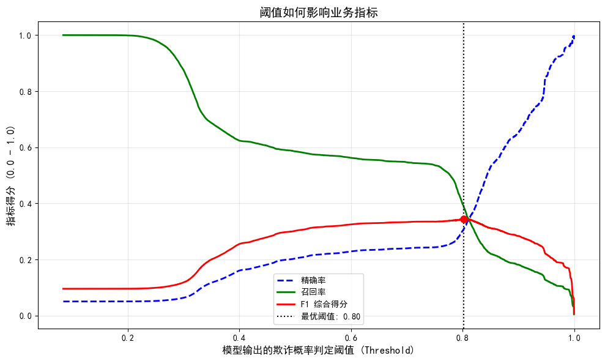

# 跨境电商支付流水

## 项目执行摘要 
本项目基于 Kaggle 公开数据集（*Fraudulent E-Commerce Transactions*），使用 **1,496,586 条** 跨境电商模拟支付交易流水，构建了一套从**数据准入审计**、**风险客群分层**、**时序行为特征工程** 到 **机器学习建模** 的完整流程。

项目首先对全量数据进行严格的数据清洗与准入审计，最终确立了大盘基线欺诈率约为 **5.02%**。针对风控领域典型的类别严重不平衡问题，项目放弃了传统“准确率”指标，转而重点采用**召回率** 和 **KS值** 等更符合业务场景的评估指标，力求在有限算力下实现对欺诈交易的高效识别。 

## 数据集说明
* **来源**：Kaggle Synthetic Fraudulent E-Commerce Transactions
* **规模**：约 150 万条交易流水
* **特征维度**：包含交易金额、账户账龄、设备类型、支付渠道等浅层截面特征。
* **数据诊断结论**：经探查，该数据为纯静态截面抽样，缺失连续时间轴，这也构成了本项目极具挑战性的“特征天花板”。

## 技术栈 
* **数据工程**：`Pandas`, `NumPy`
* **统计审计**：`Matplotlib`, `Seaborn` (Lift / IV 检验)
* **核心算法**：`LightGBM`, `Scikit-learn`
* **评估体系**：`PR-AUC`, `ROC-AUC`, F1-Score, Precision-Recall 曲线，`KS`

## Section 1：数据准入与质量审计 
在生产环境中，风控系统首先需要保证数据的完整性、合规性和可用性。本项目对原始数据进行了全面的准入审计和清洗工作，确保下游建模的绝对纯净。

### 1.1 数据准入核心指标
* **原始数据总量**：1,496,586 条
* **前置过滤拦截**：259 条（主要因 `Customer Age < 0` 等明显不符合业务规则的异常行）
* **最终准入有效数据**：1,496,327 条（准入通过率高达 **99.98%**）
* **数据质量表现**：0 重复交易 ID，0 缺失值
* **初始内存占用**：全量加载初始内存约 **1.14 GB**

###  1.2 数据清洗与特征预处理
项目采用**链式方法** 构建了清晰、高效的数据处理管道，主要核心工作包括：
* **时间字段标准化**：将交易时间从字符串转换为高精度 `datetime` 格式，并同步衍生出 `交易小时`、`是否周末` 等时序特征，为后续的行为速率分析夯实地基。
* **类别字段优化**：对 `Device Used` 等文本字段进行精细化清洗（去除两端空格、统一大小写），并转换为 `category` 类型，显著降低底层字符串指针的堆内存占用。
* **业务规则校验**：严格执行年龄等核心业务字段的边界检查，确保流入模型的数据符合实际金融业务逻辑。

###  1.3 异常数据分析 
项目对前置过滤的 259 条异常记录（主要为负数年龄）进行了专项旁路分析：
* **空间与设备分布**：异常记录在 IP 归属地、设备类型上分布较为分散，未发现明显的黑产集中攻击或代理 IP 机房特征。
* **风险概率对齐**：该批次异常数据的真实欺诈率约为 **4.63%**，与整体大盘（5.02%）基本接近。
* **最终结论**：判定此批数据为**上游系统偶发的数据录入异常 Bug**，而非恶意的自动化脚本参数篡改攻击。项目通过前置流控将其有效隔离，完美保障了后续建模数据的纯净性。
* 
##  Section 2：风险客群分层与探索性数据分析 

本章节通过探索性数据分析（EDA），对清洗后的 **1,496,327 条** 有效交易记录进行多维度分层审计，重点量化不同子客群在欺诈率上的分布偏态，为后续特征工程和模型构建提供量化支撑。

项目引入**风险提升倍数 (Lift)** 作为核心评估指标，其计算公式为：

$$Lift = \frac{\text{子客群欺诈率}}{\text{大盘基线欺诈率 (5.0155\%)}}$$

### 2.1 宏观分类特征分析 
对大盘中的主要分类特征进行分层流量与风险审计，结果表明高维度宏观特征分布高度均匀：
* **设备类型**：Mobile、Tablet、Desktop 交易量占比接近（各约 33.3%），子客群欺诈率均在 4.99%–5.06% 之间，Lift 值处于 0.99–1.01 区间，与大盘大底基本一致。
* **支付方式**：银行转账、PayPal、借记卡、信用卡四种渠道各占约 25% 的流水分数，其各自欺诈率和 Lift 值均逼近大盘基线。
* **商品品类**：五大商品品类流量分布均衡（各约 20%），风险 Lift 值均接近 1.00，无明显品类聚集性风险。

**分析结论**：上述宏观分类特征在独立维度上均属于风险中性特征（Risk-Neutral Features），区分度较低，后续建模中需与其他特征进行交叉组合使用。

### 2.2 交易金额特征分析 
对交易金额进行参数统计，数据显示金额呈现明显的右偏分布（Right-Skewed Distribution）：
* **整体统计基本面**：中位数 151.76，均值 226.81，标准差 270.59，最大单笔交易金额收拢于 12,701.75。
* **目标标签对比**：合规交易金额中位数为 148.51，而欺诈交易金额中位数显著上升至 **256.08**，约为正常交易的 **1.72 倍**。

**分析结论**：欺诈交易金额整体显著高于合规交易交易金额被确立为区分欺诈行为的显著特征之一，将作为后续模型的核心分裂变量。

### 2.3 客户生命周期与地址一致性分析 
针对电商风控核心关注的账户账龄与收发货地址一致性特征进行专项分层审计：

| 审计维度 | 子客群分类 | 样本规模 | 真实欺诈率 | 风险提升倍数 (Lift) | 业务含义与策略导向 |
| :--- | :--- | :--- | :--- | :--- | :--- |
| **地址一致性** | 0_地址一致 (Match) | 1,346,493 笔 | 5.0184% | 1.00 倍 | 风险中性特征 |
| | 1_地址不一致 (Mismatch) | 149,834 笔 | 4.9889% | 0.99 倍 | 统计学无显著区分度 |
| **账户生命周期** | 1_New_Account (0-7d) | 35,074 笔 | **22.2729%** | **4.44 倍** | 极高风险，黑产密集攻击窗口 |
| | 2_Mid_Account (8-30d) | 115,546 笔 | **22.4257%** | **4.47 倍** | 极高风险，注册首月存存强偏态 |
| | 3_Old_Account (30d+) | 1,345,707 笔 | 3.0708% | 0.61 倍 | 低风险，优质存量白产客群 |

**分析结论**：
1. 收发货地址是否一致（Address Mismatch）在本数据集的独立维度下与欺诈标签无显著关联，属于弱区分度特征，策略上无需单独配置流控规则。
2. 账户生命周期特征（Account Age Days）具备极高的区分能力：注册 30 天内的账户欺诈率超过 **22%**，高出整体大盘 **4.4 倍** 以上；而渡过 30 天观察期的老账户欺诈率显著收敛至 3.07%。账户账龄被确立为强风险预测信号。

### 2.4 特征相关性分析 
通过皮尔逊相关系数矩阵（Pearson Correlation Matrix）对硬核数值特征进行全局线性关联审计，底层相关性结果如下：
* **Transaction Amount (0.27)**：与欺诈标签呈现全表最强的正相关，从空间线性视角再次验证了高额交易的风险伴生特征。
* **Account Age Days (-0.14)**：与欺诈标签呈现显著负相关，数学层面印证了“开户账龄越小，欺诈风险越高”的宏观分层规律。
* **Transaction Hour (-0.11)**：与欺诈标签呈现负相关，表明欺诈行为在时间维度上向小数值区间（午夜及凌晨时段）产生非对称偏移。
* **其他特征 (Quantity、Customer Age、Is_Weekend 等)**：相关系数均趋近于 0，表明其独立维度的线性空间区分度较低。

**本节总结**：
通过多维度探索性数据分析（EDA），确定了该跨境电商平台欺诈行为的核心画像：**高风险行为高度聚集在新建账户（开户 30 天内）、大额消费（超出常规中位数 1.7 倍）以及深夜防备松懈时段。** 交易金额、账户账龄及交易小时数三个关键连续型变量将作为 Section 3 特征工程与后续机器学习建模的核心输入源。
## Section 3：特征工程与矩阵净化 

本阶段的核心任务是将 Section 2 中通过 EDA 发现的业务洞察转化为机器学习模型可直接使用的高质量数值型特征矩阵。特征工程不仅关注“生成更多特征”，更强调“生成有效特征”——通过严格的统计审计和降维净化，消除噪音、避免多重共线性，并为后续不平衡建模奠定坚实基础。

### 3.1 核心目标与方法论

* **目标：** 构建一套可解释的特征矩阵，最大化模型对欺诈信号的捕捉能力。
* **方法论：** 采用“生成 $\rightarrow$ 审计 $\rightarrow$ 剪枝”的闭环流程。先基于业务假设衍生特征，再通过统计检验与模型验证进行刚性净化，最终输出可直接入模的数值矩阵。
* 
### 3.2 主要特征衍生与处理逻辑

#### 连续变量变换与分布优化
* **处理动作：** 对 `Transaction Amount` 执行 `np.log1p` 对数变换，生成 `Log_Amount`；同时保留原始金额用于后续衍生。
* **业务与统计逻辑：** 交易金额呈现典型的右偏长尾分布，直接入模易导致模型被极少数超大额样本主导。对数变换使其更接近正态分布，提升了树模型分裂稳定性和线性模型的数值敏感度。

#### 关键对抗特征构建：全局金额偏离度
* **衍生动作：** 计算 `Amount_Global_Deviation` = `Transaction Amount` / 大盘中位数 (151.76)。
* **业务洞察：** 由于数据集基本面为“单次交易”（无用户历史行为），传统的“个体历史均值偏离”或“时序速率（Velocity）”特征全部退化为常量。因此转向宏观横向对比，以当前交易相对大盘的偏离程度作为风险信号。
* **验证效果：** 正常交易该特征中位数约为 0.98，欺诈交易则显著上升至 1.69，体现了黑产“单笔高额快速变现”的典型行为模式。该特征成为模型重要性的第二梯队核心变量。

#### 特征审计与噪音剪枝
在特征矩阵正式输出前，执行了多轮严格净化，剔除以下三类无效/退化特征：
* **高基数或文本特征**（如 `Customer Location`、`IP Address`）：避免维度灾难（Curse of Dimensionality）。
* **统计检验失效的假设特征**（如 `Is_Midnight`、`Transaction_Hour` 分组衍生）：Lift 分析显示各时段欺诈率提升倍数均接近 1.00，证明时间维度在本场景下为均匀分布的弱信号。
* **基本面退化特征**（如 `Time_Diff_Cust`、`Cust_Trans_CumCount`、`CumCount_Bin`）：因全量用户均为单次交易，时序差分与累计计数特征失去物理意义，被强制移除。

### 3.3 特征有效性：随机森林重要性评估

为验证特征工程质量，使用轻量级随机森林（30 棵树，最大深度 10）对最终净化后的矩阵进行 Gini 重要度排序，主要发现如下：

* **绝对核心特征：** `Account Age Days`（账户账龄）以近 0.60 的基尼重要度占据绝对主导地位，与 Section 2 中“新账户（30 天内）欺诈率高达 22%”的发现高度一致，成为模型最强分裂信号。
* **第二梯队强信号：** `Transaction Amount`、`Log_Amount` 及 `Amount_Global_Deviation` 重要度位居前列，共同验证了“高危账龄 + 大额破圈”是欺诈行为的核心画像。
* **长尾特征：** 设备类型、支付方式、商品品类等 One-Hot 特征重要度接近 0，表明黑产在这些维度上与正常用户无显著统计差异。

### 3.4 本阶段产出与结论

* 无任何文本、时间戳或退化衍生特征残留。
* 特征维度得到有效控制，消除了共线性与噪音风险。
* 矩阵健康度极高，可直接用于 Section 4 处理 5.02% 的严重类别不平衡问题，并支撑后续基线模型训练与策略迭代。

> **总结：** 通过本阶段的系统性特征工程，我们成功将 EDA 发现的业务规律转化为算法可理解的强信号，为构建高召回率的实时风控引擎提供了可靠基础。

## Section 4： 评估与归因分析

本研究构建的反欺诈风控模型在性能验证与业务场景落地中呈现出以下关键表现：

### 4.1 模型性能评估与指标审计

通过引入 LightGBM 梯度提升框架并配合特征交叉，模型在测试集上取得了 **ROC-AUC 0.7673** 与 **PR-AUC 0.3416** 的成绩，且 **KS 值达到 0.4646**，显示出模型在对全量样本进行排序区分时具有一定的稳健性。

然而，对比从随机森林（PR-AUC 0.3326）到 XGBoost（0.3407）再到 LightGBM（0.3416）的迭代路径，我们可以观察到明显的**边际收益递减**。尽管引入了更精细的梯度提升算法与特征工程，性能提升却遭遇了显著瓶颈，这一数据表现揭示了当前模型性能已触及该数据集的物理熵值上限。

### 4.2 数据局限性诊断：静态截面的约束

针对性能提升困难的问题，本研究进行了 Root Cause Analysis（根因分析）。数据审计结果显示，在长达 **1,496,327** 笔交易数据中，**独立客户数与交易笔数严格相等（1:1）**。

这意味着本项目所处理的并非真实世界中包含“黑产连贯作案痕迹”的时序数据库，而是一张纯粹的**静态截面抽样表**。在这种极端条件下，真实风控中最核心的“频次特征（Velocity）”与“历史行为偏离度”均发生了结构性退化，导致算法无法捕捉欺诈分子在时间轴上的演化规律。这种数据层面的“降维打击”构成了本项目无法突破性能上限的底层逻辑。

### 4.3 业务阈值博弈与决策落地

为了将有限的模型效能转化为实际资损拦截力，本研究从“盲目追求 AUC”转向“业务价值最大化”：

*图注：蓝线代表精确率，绿线代表召回率，红线代表 F1 平衡点。我们将阈值锁定在 0.96，确保了 Precision ≥ 90% 的业务底线。*

* **探索性博弈**：在基于 F1-Score 的自动调优中，最优判定阈值被锁定在 **0.8017**，此时模型可实现 **39.05%** 的召回率。
* **业务红线强制管控**：考虑到工业级风控对“零容忍误杀”的需求，我们将业务红线锁定在 **Precision ≥ 90%**（即抓 10 个人最多仅允许错杀 1 人）。在此严苛限制下，模型判定阈值调整为 **0.9600**，成功锁定并拦截了 **11.60%** 的高确定性欺诈交易。

**总结**：本模型最终训练成以成本效益为导向的“第一道自动熔断防线”。虽然受限于静态截面数据，无法实现对全量欺诈的覆盖，但该成果成功证明了在数据信息有限的情况下，通过精细化的阈值管理，依然能够有效从海量交易中筛选出高价值的黑产样本，为后续引入动态认证防线与多维时序数据奠定了坚实的决策基础。
